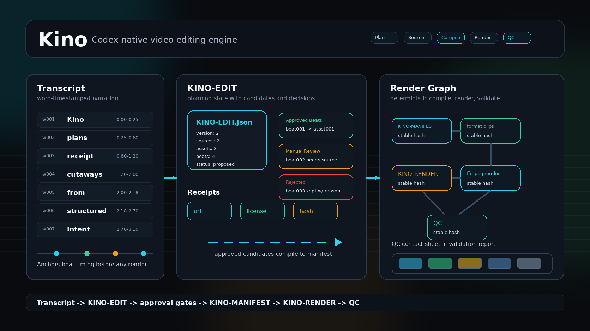

# Kino



Kino is a Codex-native video edit engine: a manifest-driven core plus helper tooling for planning, assembling, rendering, exporting, and verifying video edits.

The current executable format is `KINO-MANIFEST.json` for cutaway edits. The staged edit-engine foundation is `KINO-EDIT.json`: a project-level planning model for transcript tokens, sources, asset candidates, beat candidates, approvals, and rejections. `KINO-PLAN.json` is the reviewable beat-plan contract that Codex can propose before assets are sourced or merged into project state. The package also includes a typed render graph that can represent the existing cutaway manifest, plus render receipts for cutaway renders.

This repo is intentionally split into:

- `kino/SKILL.md`: compact Codex instructions loaded when the skill triggers.
- `kino/references/`: detailed routing, profile, manifest, and verification guidance loaded only when needed.
- `src/kino/`: deterministic Python helpers for manifest validation, still zooms, page capture, rendering, and verification-frame extraction.
- `plugins/kino/`: repo-local Codex plugin scaffold for packaging the skill once the workflow stabilizes.
- `tests/`: fast unit tests for manifest, render-command, probing, export, and validation behavior.

## Quick Start

```bash
python3 -m venv .venv
. .venv/bin/activate
pip install -e ".[dev]"
python kino/scripts/kino_tool.py --help
pytest
```

Run the reproducible sample edit:

```bash
python3 examples/quickstart/run.py
```

The quickstart generates tiny media with `ffmpeg`, writes all artifacts under `examples/quickstart/out/`, and exercises the current executable loop: `init-edit` -> `add-source`/`add-asset` -> `propose-beat` -> `approve-beat`/`reject-beat` -> `compile-manifest` -> `render-cutaways` -> `verify-frames` -> `make-contact-sheet` -> `check-frames` -> `analyze-audio` -> `export-variant` -> `validate-export` -> `review-media` -> `eval`. It is intentionally local and deterministic: no reference video, stock media, or network sourcing is required.

Generate lightweight archetype replica sketches for the two reference video formats:

```bash
python3 examples/archetypes/run.py --workdir /tmp/kino-archetypes
kino plan-replica examples/archetypes/social-short/reference-analysis.json --json-out /tmp/kino-social-plan.json
```

The archetype runner adapts the checked-in `recipe.json` contracts into tiny synthetic media, writes intent-level `KINO-EDIT.json` plus executable `KINO-MANIFEST.json` skeletons for `social-short` and `founder-product-explainer`, and can optionally render those manifests with `--render`. No downloaded reference video is committed or required. Full-fidelity reference replication, live sourcing, and graph execution remain future work.

Generate proposed beats from an edit state without exposing a manual timeline:

```bash
kino plan-edit KINO-EDIT.json KINO-PLAN.json --archetype social-short
kino validate-plan KINO-PLAN.json
kino apply-plan KINO-PLAN.json KINO-EDIT.json --out KINO-EDIT.json
```

Plan and burn in transcript captions:

```bash
kino plan-captions KINO-EDIT.json KINO-CAPTIONS.json --archetype social-short
kino validate-captions KINO-CAPTIONS.json --edit KINO-EDIT.json
kino render-captions input.mp4 KINO-CAPTIONS.json output.captioned.mp4
```

Aggregate plan, caption, frame, audio, and export checks into a single iteration scorecard:

```bash
kino review-media output.vertical.mp4 --preset vertical-social \
  --frames-dir review_frames --contact-sheet KINO-REVIEW-SHEET.jpg \
  --out KINO-REVIEW.json --md-out KINO-REVIEW.md
kino eval --plan KINO-PLAN.json --captions KINO-CAPTIONS.json \
  --review KINO-REVIEW.json --frame-qc KINO-FRAME-QC.json --audio-qc KINO-AUDIO-QC.json \
  --validation KINO-VALIDATION.json --out KINO-EVAL.json --md-out KINO-EVAL.md
```

External tools used by real video workflows:

- `ffmpeg` and `ffprobe`
- Chrome or Chromium for page capture
- `yt-dlp` for public video metadata/downloads
- Whisper or another transcription tool that can emit word timestamps

## Project State

This is the starter scaffold. The first usable slice is the manifest-driven cutaway rendering loop:

1. plan beats with Codex
2. save them to `KINO-MANIFEST.json`
3. validate with `validate-manifest`
4. render with `render-cutaways`
5. extract inspection frames with `verify-frames`
6. generate a contact sheet and frame/audio QC reports

The first quality-harness commands are also available:

```bash
kino --help
kino list-presets
kino list-archetypes
kino plan-replica examples/archetypes/social-short/reference-analysis.json --json-out KINO-REPLICA-PLAN.json
kino probe-media output.mp4
kino make-contact-sheet verify_frames KINO-CONTACT-SHEET.jpg
kino check-frames verify_frames --manifest KINO-MANIFEST.json --json-out KINO-FRAME-QC.json --md-out KINO-FRAME-QC.md
kino analyze-audio output.mp4 --json-out KINO-AUDIO-QC.json --md-out KINO-AUDIO-QC.md
kino validate-export output.mp4 --preset vertical-social --json-out KINO-VALIDATION.json --md-out KINO-VALIDATION.md
kino validate-export output.mp4 --preset vertical-social --strict
kino export-variant output.mp4 output.vertical.mp4 --preset vertical-social
kino review-media output.vertical.mp4 --preset vertical-social --frames-dir review_frames --contact-sheet KINO-REVIEW-SHEET.jpg --out KINO-REVIEW.json --md-out KINO-REVIEW.md
kino eval --review KINO-REVIEW.json --frame-qc KINO-FRAME-QC.json --audio-qc KINO-AUDIO-QC.json --validation KINO-VALIDATION.json --out KINO-EVAL.json --md-out KINO-EVAL.md
```

## Edit-Engine Foundation

Kino is moving in stages from a cutaway manifest to a graph-backed edit engine:

- `KINO-MANIFEST.json` remains the supported Phase 1 execution input.
- `KINO-EDIT.json` is the planning state initialized by `init-edit` for transcript tokens, source receipts, asset candidates, beat candidates, approvals, and rejections.
- `KINO-PLAN.json` is the human-review artifact between transcript understanding and edit-state mutation. It contains proposed beats, token anchors, quote snippets, route classifications, interpretations, sourcing plans, asset fit scores, reasons, and confidence values without downloading media, approving taste decisions, or exposing a user-facing timeline.
- `KINO-CAPTIONS.json` is the transcript-derived caption plan. It stores word-aligned caption segments, style presets, emphasized words, reasons, and confidence, then renders through `render-captions`.
- `KINO-REVIEW.json` is the direct media review artifact. It probes an exported video, samples review frames, checks audio, validates the export preset, and can check caption/archetype contracts without exposing a user-facing timeline.
- `KINO-EVAL.json` is the build/test/refine scorecard. It aggregates plan quality, caption quality, direct media review, frame QC, audio QC, and export validation into an overall status, score, decision, and next recommendations.
- The second build target is a transcript-to-manifest planning loop: initialize an edit, propose beats from transcript ranges, approve or reject each candidate, then run `compile-manifest` to write the approved beats into `KINO-MANIFEST.json`.
- Rendering still goes through `KINO-MANIFEST.json`: validate with `validate-manifest`, render with `render-cutaways`, inspect with `verify-frames`, and write QC artifacts with `make-contact-sheet`, `check-frames`, and `analyze-audio`.
- The render graph is a typed intermediate representation for sources, tracks, clips, outputs, validation expectations, canonical JSON, and stable hashes.
- Cutaway renders now write `KINO-RENDER.json` with manifest hash, render graph hash, ffmpeg command hash, tool versions, paths, and formatted-asset commands.
- Source receipts are represented in `KINO-EDIT.json`; automated source-receipt writing and graph execution are still future work.
- Archetype replication is represented as intent-level plans: `list-archetypes`, `plan-replica`, and `examples/archetypes/` describe social-short and founder-product-explainer structures without exposing timeline editing to the user.

### KINO-PLAN CLI

```bash
kino plan-edit KINO-EDIT.json KINO-PLAN.json --archetype social-short
kino validate-plan KINO-PLAN.json
kino apply-plan KINO-PLAN.json KINO-EDIT.json --out KINO-EDIT.json
```

`plan-edit` reads transcript, source, and asset state from `KINO-EDIT.json`, chooses archetype sections, scores matching assets, and writes proposed beats with reasons and confidence. `validate-plan` is the schema/editorial gate. `apply-plan` imports validated beats into `KINO-EDIT.json` as `proposed` while preserving plan rationale metadata; rendering still requires explicit approval and `compile-manifest`.

### KINO-CAPTIONS CLI

```bash
kino plan-captions KINO-EDIT.json KINO-CAPTIONS.json --archetype social-short
kino validate-captions KINO-CAPTIONS.json --edit KINO-EDIT.json
kino render-captions input.mp4 KINO-CAPTIONS.json output.captioned.mp4
```

`plan-captions` turns transcript word timings into caption segments using archetype-specific style presets. `validate-captions` checks readability, anchors, confidence bounds, and optional transcript hash parity. `render-captions` writes an ASS subtitle sidecar and burns it into the video with ffmpeg.

### KINO-EVAL CLI

```bash
kino review-media output.vertical.mp4 --preset vertical-social \
  --archetype social-short --captions KINO-CAPTIONS.json \
  --frames-dir review_frames --contact-sheet KINO-REVIEW-SHEET.jpg \
  --out KINO-REVIEW.json --md-out KINO-REVIEW.md
kino eval --plan KINO-PLAN.json --captions KINO-CAPTIONS.json \
  --review KINO-REVIEW.json --frame-qc KINO-FRAME-QC.json --audio-qc KINO-AUDIO-QC.json \
  --validation KINO-VALIDATION.json --out KINO-EVAL.json --md-out KINO-EVAL.md
```

`review-media` is the media-aware reviewer that looks at the actual rendered/exported file. `eval` normalizes existing artifact checks into one release-readiness report. Default mode exits nonzero only on `fail`; `--strict` exits nonzero unless the decision is clean enough to pass without review.

## Examples And Docs Contract

- `examples/quickstart/` is the smoke-test sample for the current render/export/QC loop. It proves that approved `KINO-EDIT.json` beats compile to `KINO-MANIFEST.json`, render through cutaways, and produce verification, audio QC, export, validation, direct review, and evaluation artifacts.
- `examples/archetypes/` is the planning-contract sample for social shorts and founder product explainers. It proves that repo-safe archetype fixtures can be loaded, classified, planned with `plan-replica`, and materialized into synthetic edit/manifest skeletons without committing media blobs.
- `KINO-PLAN.json`, `KINO-CAPTIONS.json`, and `KINO-REVIEW.json` are review artifacts, and `KINO-EVAL.json` is the aggregate handoff artifact. Rendering still flows through `KINO-MANIFEST.json` until graph execution is implemented.

## Product Direction

The project goal and full product specification live in:

- [docs/goal.md](docs/goal.md)
- [docs/product-spec.md](docs/product-spec.md)
- [docs/phase-1-build-goal.md](docs/phase-1-build-goal.md)

Short version: keep iterating as a Codex skill while the workflow is changing, then package it as a Codex plugin once it is stable enough for marketplace-style installation.
